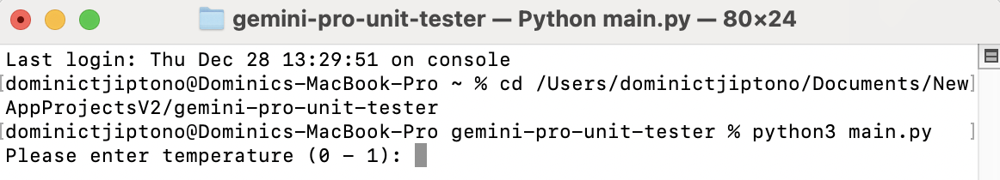

# gemini-pro-unit-tester

Ever wondered about running unit tests without even to write a single line of code? Well, **Gemini Pro Unit Tester**
allows you to do so easily!

# Source Code

The source code of the application **Gemini Pro Unit Tester** is available in

# Installation

```
pip install gemini-pro-unit-tester
```

# How to Use the Application?

Pre-requisites:
1. [Python](https://www.python.org/downloads/) installed in your device.
2. .env file in the same directory as <GEMINI_PRO_UNIT_TESTER_DIRECTORY> and has the value of GEMINI_API_KEY.

First, open a Terminal or Command Prompt window and run the following command.

```
cd <GEMINI_PRO_UNIT_TESTER_DIRECTORY>
python3 main.py
```

**Note:** Replace <GEMINI_PRO_UNIT_TESTER_DIRECTORY> with the path to the directory of the 
application **Gemini Pro Unit Tester**.

Then, the application will start with something looking like in the screenshot below.



You will then be asked to input the following values.

1. Temperature - between 0 and 1 inclusive
2. Top P - between 0 and 1 inclusive
3. Top K - at least 1
4. Max output tokens - at least 1

The following screenshot shows what is displayed after inputting the mentioned values.

# Progress

1. Supports creating and running unit tests for one file. (ongoing)
2. Supports creation of unit tests based on code in multiple files. (pending)

# Version History

1. Version 0.5 (Release Date: 29 December 2023):
* Supports creating and running unit tests for one file.

2. Version 1 (Release Date: TBA, 2024):
* Supports creation of unit tests based on code in multiple files.
